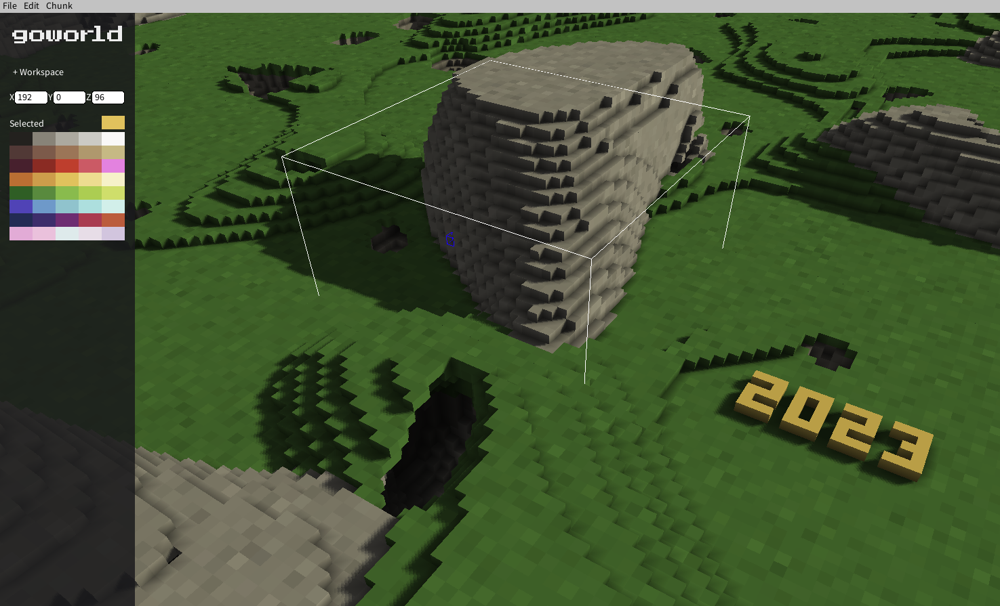
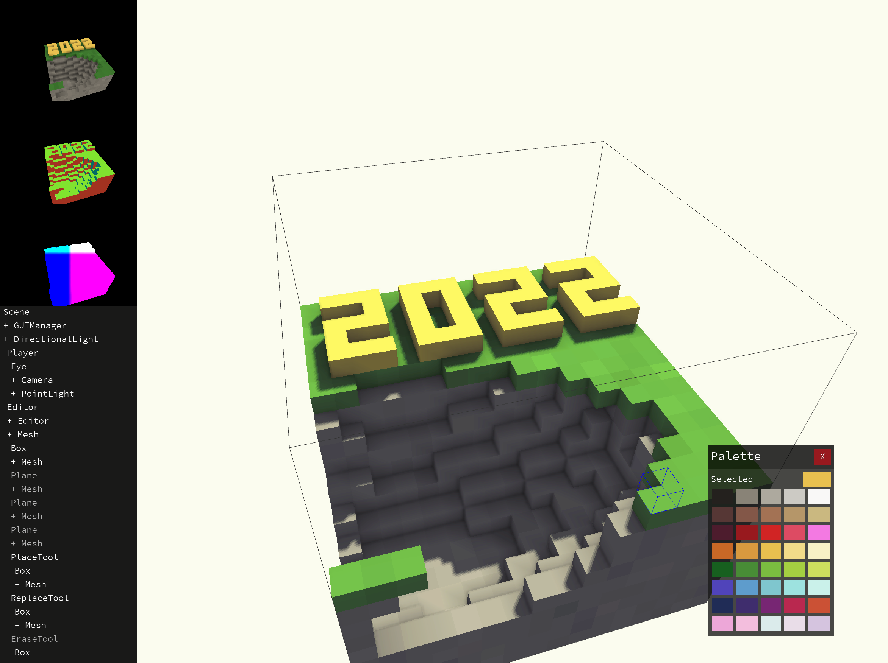
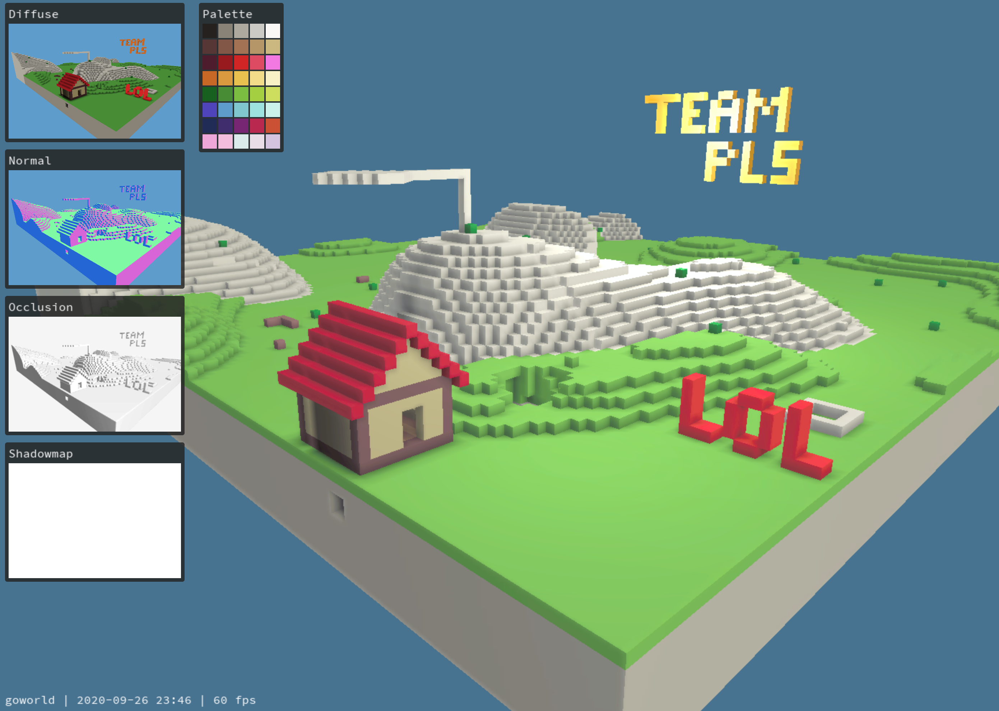
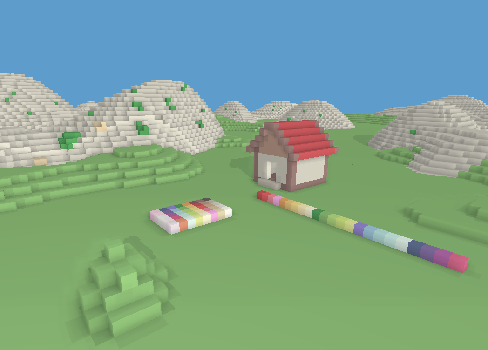

# goworld

*Not in active development! Working on it occasionally.*

Yet another attempt at building a basic 3D engine from scratch, this time in Go. The goal is to create a engine capable of producing *some* kind of *passable* graphics with a coherent art style. So far, the style is based around colored voxels.

**Features:**
- Voxel world/editor demo
- Deferred Rendering Pipeline
- Directional Lights
- Directional Shadows
- Point Lights
- TrueType Font Rendering
- React-like UI including a flexbox layout engine
- Custom ergonomic 3D math library derived from mathgl and go3d
- Screen-Space Ambient Occlusion (HBAO) (not yet ported to vulkan)
- Color Grading with Lookup Tables (not yet ported to vulkan)

Tested on OSX 10.10+ and Manjaro Linux. It should *theoretically* work on Windows.

## System Requirements

 * Vulkan 1.0
 * MacOS users need MoltenVK.
